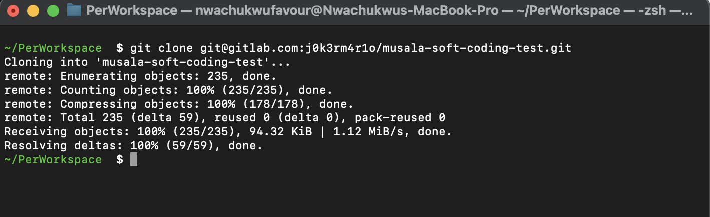
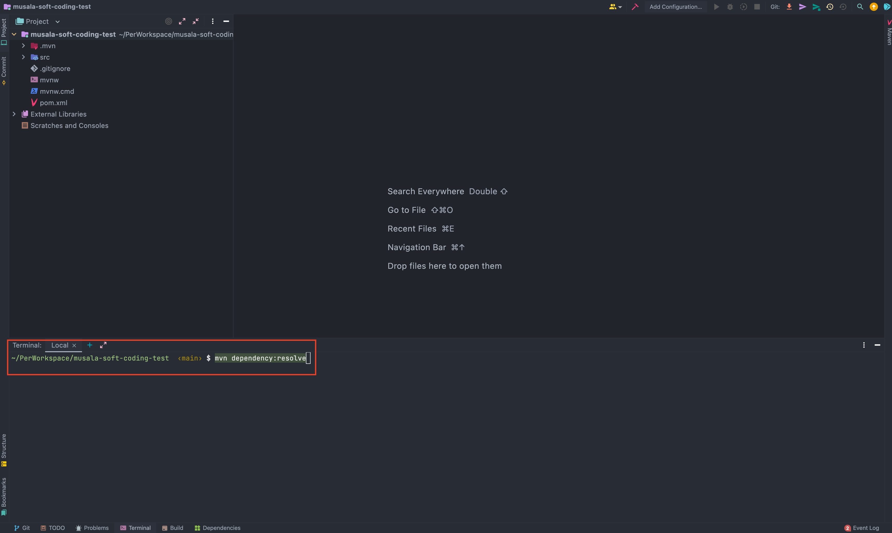
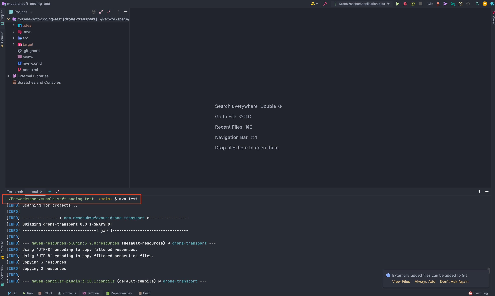
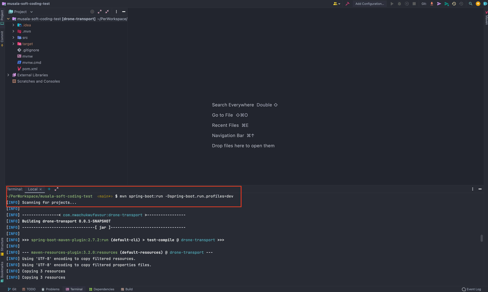

## Drone Service

[[_TOC_]]

:scroll: **START**

### Introduction

This test was completed using the Java programming language in conjunction with the
spring-boot framework and Webflux (Java Reactor). An In-Memory database(H2) was used to persist data. 
The api was built **to be reactive and non-blocking**

**NOTE** 
1. The database is pre-populated with six(6) drones and three(3) medications.
2. The battery of the drones drains in a ratio every 1 minute 30 secs. 
This means that there is scheduler that automatically runs every 
3 minutes and its job is to deplete the battery percentage. 
So when you encounter a battery low error (i.e when the battery percentage hits 20%) 
do well to restart the application so that all the batteries would go back to the percentage
you specified when you created the drone or 100% for the default drones.
3. The logs reside here `src/main/resources/log/batteryInfo.log`

### Requirements
- Java 11
- set `JAVA_HOME` env to java installation directory
- Apache Maven ``3.8.4 or later``

### Build/Run/Test instruction
1. Git clone the repository. Run the command on your terminal.  For ssh run: ``git clone git@gitlab.com:j0k3rm4r1o/musala-soft-coding-test.git``
  For HTTP run: ``git clone https://gitlab.com/j0k3rm4r1o/musala-soft-coding-test.git``
   
2. Go to an IDE of your choice and open the ``musala-soft-coding-test`` folder in the IDE.
3. Download all dependency in the ``pom.xml`` file by going to the project root in your terminal and running the command: ``mvn dependency:resolve``
   
4. Run the **Tests** with the command: ``mvn test``
   
5. Run the command:  ``mvn spring-boot:run -Dspring-boot.run.profiles=dev`` to start the application
   

### Documentation
Http request can be sent to the server on the port specified by `server.port` property in the **application-dev.yml**

The Documentation for all sever endpoints can be found here
[Postman Documentation for Musala Soft Drone](https://documenter.getpostman.com/view/9467922/UzXPywuq)

:scroll: **END**